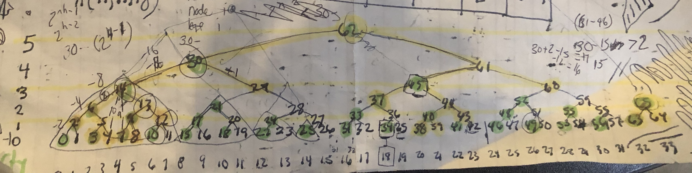

# Merkle Mountain Range

A type of merkle tree that could be described as many merkle trees which are then combined into 1, by making another merkle tree of their roots. The rules for making the tree(s) however are rigidly deterministic such that the entire structure depends only on the number of items put into it.

The MMR has many unique properties making it optimal for proving the ordering of a linked hashlist (as described in [FlyClient](https://www.youtube.com/watch?v=BPNs9EVxWrA))





## Resources 

[MMR data structure](https://github.com/juinc/tilap/issues/244) invented by Peter Todd

I have ammended the structure slightly to work better for flyclient (I beleive it will work better for most use-cases). The difference is that the "bagging the peaks" process (used to calculate the merkle-root) by Todd was changed to instead simply digest the peaks as a concatonated array

## Use

```
npm install merkle-mountain-range
```

```javascript
const { MMR, keccak256FlyHash } = require('merkle-mountain-range')
let mmr = new MMR(keccak256FlyHash)
let genesisHash       = Buffer.from('d4e56740f876aef8c010b86a40d5f56745a118d0906a34e69aec8c0db1cb8fa3','hex')
let genesisDifficulty = Buffer.from('0000000000000000000000000000000000000000000000000000000400000000','hex')
let zeroithLeaf = Buffer.concat([genesisHash, genesisDifficulty])
mmr.append(zeroithLeaf, 0).then(()=>{ console.log(mmr) })
```

#### Statistics

With (memoryBasedDb) 1000 64-byte leaves (2015 macbookpro)
 - Time per `append()` =  0.000119s
 - Time per `get()` =  0.000289s


### Contributing

How to contribute, build and release are outlined in [CONTRIBUTING.md](CONTRIBUTING.md), [BUILDING.md](BUILDING.md) and [RELEASING.md](RELEASING.md) respectively. Commits in this repository follow the [CONVENTIONAL_COMMITS.md](CONVENTIONAL_COMMITS.md) specification.

