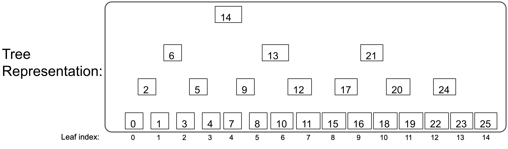

#  Merkle Mountain Range

A type of merkle tree that can be visualized as many (perfect) merkle trees which are then combined into 1, by creating a single root from all of their peaks. The rules for making the tree(s) however are rigidly deterministic such that the entire structure depends only on the number of items put into it. When appending leaves, nodes are not updated, only appended. This makes for a minimal amount of total hash computations (~2n), while maintaining the property that no nodes are updated when appending new leaves (nodes are merely added). Because of this, the _merkle inclusion proofs_ are _also_ only appended to meaning that later proofs are sufficient (supersets of) earlier proofs.

A Golang version of this can be found [here](https://github.com/zmitton/go-merklemountainrange).

These unique properties make it optimal for proving the work of an entire PoW blockchain. A protocol that does this is [FlyClient](https://www.youtube.com/watch?v=BPNs9EVxWrA).



## Resources 

MMR data structure as described by Peter Todd:
([Reyzin and Yakoubov](https://eprint.iacr.org/2015/718.pdf) may have proposed at a similar data structure in 2015)
 
 - [Basics](https://github.com/opentimestamps/opentimestamps-server/blob/master/doc/merkle-mountain-range.md)
 - [Detailed properties and python code](https://github.com/proofchains/python-proofmarshal/blob/master/proofmarshal/mmr.py)
 - [implimentation / feture recomendations](https://github.com/mimblewimble/grin/blob/master/doc/mmr.md)
 - [an early proposed application](https://lists.linuxfoundation.org/pipermail/bitcoin-dev/2016-May/012715.html)

I have improved the structure slightly from the above references (by simplifying it). The difference is in the "bagging the peaks" process (used to calculate the merkle-root). Todd's process takes the peaks and creates another merkle tree from them in order to attain a single root. My process is to simply digest the peaks as a single concatenated array to attain a single root.

Why?

1. Using Todd's process it was ([by his own admission](https://github.com/proofchains/python-proofmarshal/blob/master/proofmarshal/mmr.py#L139)) very difficult to logically determine leaf position from an inclusion proof.

2. The `getRoot` method concatenates the peaks and hashes them on the fly (the root is never persisted). This process is very cheap because there are only ~log(n)/2 peaks.


## Use

```
npm install merkle-mountain-range
```

```javascript
const { MMR, keccak256FlyHash } = require('merkle-mountain-range')
let mmr = new MMR(keccak256FlyHash)
let genesisHash       = Buffer.from('d4e56740f876aef8c010b86a40d5f56745a118d0906a34e69aec8c0db1cb8fa3','hex')
let genesisDifficulty = Buffer.from('0000000000000000000000000000000000000000000000000000000400000000','hex')
let zeroithLeaf = Buffer.concat([genesisHash, genesisDifficulty])
mmr.append(zeroithLeaf, 0).then(()=>{ console.log(mmr) })
```

#### Statistics

With 1000 64-byte leaves (2015 macbookpro)
 - MemoryBasedDb
   - Time per `append()` =  0.000119s
   - Time per `get()` =  0.000289s
   - Time per `mmr._getNodeValue(MMR.getNodePosition(leafIndex))` about 0.00002
 - FileBasedDb
   - Time per `append()` =  0.000301s
   - Time per `get()` =  0.000719s
   - Time per `mmr._getNodeValue(MMR.getNodePosition(leafIndex))` about 0.00004

The cost of `mmr.get(leafIndex)` can be reduced by instead using `mmr._getNodeValue(MMR.getNodePosition(leafIndex))`. Because `get()` verifies as it traverses down the tree. Makes it easy to not mess up verification. You can technically get a leaf much faster with a single read (that does not verify) by calculating the position and reading it directly (O(1) instead of O(logn)).

### Contributing

How to contribute, build and release are outlined in [CONTRIBUTING.md](https://github.com/zmitton/pristine/blob/master/CONTRIBUTING.md), [BUILDING.md](https://github.com/zmitton/pristine/blob/master/BUILDING.md) and [RELEASING.md](https://github.com/zmitton/pristine/blob/master/RELEASING.md) respectively. Try to follow the [CONVENTIONAL_COMMITS.md](https://github.com/zmitton/pristine/blob/master/CONVENTIONAL_COMMITS.md) specification.

Using semantic versioning (more info [here](https://github.com/zmitton/pristine/blob/master/VERSIONING.md))

Testing uses mocha. It should work to simply pull down the repo, do an `npm install`, and use `npm run test` to run the tests.


#### Changelog V0 -> V1

 - `.mmr` file has slightly different (incompatible) format to store `wordsize` (which is no longer locked to 64 bytes)
 - FileBasedDb must now be created using `.open` or `.create`. `.open` takes an additional `wordSize` argument (default = 64 bytes)
 - Support for serialized proof tree (or sparse tree)
 <!-- 4 - Refactor of `MMR` class methods into the `Position` class instead. -->
 <!-- 5 - New `_getLeafIndex(nodeIndex)` and `NewPosition(positionIndex)` functions -->
 - `Digests` has been deprecated (now `_Digests`) because it doesn't belong in this repo. You should include your own hash function package. If it does not have the required function signature - i.e: `<buffer>` in `<buffer>` out, then you will have to wrap in in one that does before using it. The digest functions used in Flyclient will be available through a seperate "flyclient" npm package.


### Merkle Proofs & Serialization Format


The most elegant way of dealing with merkle-proofs is to basically think of them as a sparse tree in which only _some_ of its nodes are present. As long as while performing a `get` the software walks from peak to leaf checking each hash properly matches its children along the way, this proves inclusion before returning the leaf. If any node required in this path traversal is not present, the sparse tree is _insufficient_ to prove this particular leaf (software currently throws Missing node error); If any hash does not match its parents, the proof is _fraudulent_ (throws Hash mismatch error).


The merkle Proof data is essentially the same data of a regular MMR (leafLength and nodes) except with only _some_ of the nodes (rather than of all of them). For example the data of a sprase mmr might look like this:

```
leafLength: 34
nodes:
  { 
    30 : <12 34 56 78 90>,
    32 : <12 34 12 34 34>,
    33 : <21 43 65 87 09>
  }
```
(whereas a similar _full_ mmr of length 34 would contain all the nodes from 0-33)

To serialize this data for remote transmission  we first arrange it into very specifically arranged arrays (of byte arrays) for RLP encoding. On the other end, the software knows that the zeroith item is leafLength and the first item is an array of nodes (in which each node is of length 2 to represent the node key pairs):

```
[
  <22>,
  [ <1e>, <12 34 56 78 90> ],
  [ <20>, <12 34 12 34 34> ],
  [ <21>, <21 43 65 87 09> ]
]
```

Finally we can `rlp.encode()` this data:

```
<d9 22 c7 1e 85 12 34 56 78 90 c7 20 85 12 34 12 34 34 c7 21 85 21 43 65 87 09>

```
`rlp.decode()` gets you exactly back to the above arrays, and the software can reinterpret the items as described above to rebuild the sparse tree. Note that these serialized bytes can be passed from Golang package to JS package and vise-versa!


#### NOTES (mostly to self):

there probably should be a whole framework for requesting more nodes (to complete insufficient proofs). A few ideas on this.

 - somehow the verifier must get the `diff`of node positions that is has, vs ones that it needs.
 - it would be maximally flexible to be able to request individual nodes - so we need a `getNodes(nodeIndexes)` method that the prover can use to return them.
 - however it would often be more concise to request particular leafIndexes and the prover would calculate which nodes to return to satisfy that. Of course this would likely return some nodes the verifier already has (like always the peaks).
 - It would be useful for these requests to include the `leafLength` AND the `root` which would LOCK the prover to an EXACT response any variation from which would be known to be fraudulent (without this, the prover could return nodes from some different tree that it genuinely thinks you are talking about (for instance a different micro-fork/re-org in our blockchain context)).

<!-- Asking myslef
 - how would the remote abstraction (of haivng a prover) be best designed? Would it be another layer on the database where it knows to remotely request/receive the extra nodes when it doesn't have them, and it saves them in the memory-db layer after it gets them? 


The problem Im having: ()


Maybe I should separate the MMRs (or databases) into types (3?... 4?). 

but there are others funcs only the proof type trees can do.

 - fullDb
 - sparseDb
 - peaksDb
 - rootDb

From the top going down, each would inherit from the lower one (and theirfore be a fully compatible superset of it). So, i.e. a `fullDB` is also a `sparseDb` and a `peaksDb` and a `rootDb`

There is already a problem with this, the old problem that the fileBasedDb (which should be a fullDb) can not easily perform `sparseDb` operations... Since sparseDbs can add leaves at any index, while fileBaedDb needs there to be (at the very least) A bunch of extra byte-padding in its place. Maybe this is solvable because the fileDb, can just throw an error when you try to add - say leaf #594875289 when it only currently contains up to leaf #1000. from the mmr standpoint is can do the operation, but the db should throw the error because it would violate the fullness property anyway. By that I mean that even if it were to do the op, it would no longer be a fullDb afterword. This isnt really true for the other relationships, is it?


here is the API:

new(hashingFunction, db = new MemoryBasedDb())
open(hashingFunction, db = new MemoryBasedDb())

newFromSerialized(hashingFunction, serializedDb)

serialize() all (doesnt do much for some of them) why do we need this even tho?
get(leafIndex, proof) all (does a verified get (so its useful for all of them)) //needs to take optional proof
append(value, proof) all (easy: return set(value, this.leafLength, proof)) //
getRoot(leafIndex) all but it relies on existing data in the rootOnly db. how to do this (other than caching)
getLeafLength() all
getNodeLength() all

set(value, leafIndex, proof) sparse only (others can only do last element) (existing js func should be 'set'). wait actually, you can probably set as long as you give a proof of the element that is being reset. Make sure that the implementation for 'set' is properly hashing up any right-siblings (if they exist (which they will only if this is a true set (rather than an append))). I don't think its properly doing this right now. Once this is fix, the function should work on ALL MMR types.

delete(leafIndex) // replace with setLeafLength(leafLength, proof). yes this would work (send proof of last elem at specified length) OK: now this function can do a totally different thing (unless its 'full'), that is it can set the length LONGER than the current length. This is an 'unsafe' function though, as there is no way to prove it (without all the new leaves which could have already been achieved through multiple appends). So this would be a feature to add unproven things... much like initiating a partial tree from a serialized subset of nodes. These are sortof a category of there own. Like an unsafe or unproven type of function. So i think that should be only the private version maybe. ok that works


getProof(leafIndexes, referenceTreeLength) yeah doesnt really make sense for anything except fullDb (and sparse can work sometimes but I'm not sure the use case)


_get(nodePosition) all (works fine but is unverified)
_getNodeValue(position) all (the recursion uses extra gas though for the peaksOnly and rootOnly versions) 
_verifyPath(currentPosition, currentValue, destinationPosition) all (but needs a good way to do it with supplied proofs)
_setLeafLength(leafLength) it should like throw an error with the fileBasedDb (because it will basically corrupt it). The levelDb based DB would actually work fine, but afterwords, it would no longer be a fullDb, it would be sparse only. So it might be worth explicitly saying so or something. Actually the best thing to do is to have the fileBaed throw an error. We do not really need a distinction between all the bellow version. They can exist under the hood, but all the same functions seem to fly for all of them (except the fileBasedDb which has been the issue from the start. It might be worth deprecating in favor of levelDb based version. Its sad to see it go though (considering its at least twice the storage efficiency). wait a minute. it does know its own leafLength so it can throw the error if you try this in the wrong context.
_hashUp(positionPairs) all (does need a layering solution for when proof db is given)


bottom line is that we probably don't need the hierarchy of these 4 types. We should just program such that they all work no matter the situation. The main plan should be to adopt a system of layering databases, so that they can be used in the regular way when suppling a proof (and other contexts). A change to the getNodeValue function could take care of this I guess if I pass it a temp db or something. Or should it be a tempMmr? the only diff is having a digest I guess which would always be the same, so temp db should be enough. either the getNodeValue function takes this extra db as an argument, or we stick a tempdb prop on the mmr instance and then delete it afterwords. Some of the functions would like to see all the nodes from the tempDb later added to the mmr (after the proof turns out to be valid). do we just _zip them on afterwords? seems fine I guess. as long as there is no reason to need layering more than 2 Dbs at a time... a recursive method would be possible otherwise (but we would still need the zip step (rather than keeping the layered dbs in place) otherwise it would degenerate the lookup process (arbitrary length db nestings))


The problem with a rootOnly db is that the root we now need to make a cached root that resets in many of the functions - set(), append(), _setLeafLength(), maybe hashUp(), others? Is there anotehr way to do this? maybe using mixins instead of inheritance? A lot of this seems like overkill. maybe these db distinctions are better as mmr distinctions... then i can give them a 'type', or even make another layer that inherits from baseMmr which overwrites the getRoot() function. 

After some implementation and practice, Ive realized that although the above functions apply to _all_ the mmr types, that only means that they make sense to have for that type, NOT that they can/should be implimented the same. I found out, that behavior differs greatly between the types, so 1 - its a matter relevent to the mmr NOT the db (db shouldnt know/care about mmr behavior), but also to do this, instead of having types with lots of conditionals, it seems that it will make more sense to go the inheritance route. i.e. each type is its own class inheriting from BaseMmr and overwriting many of its functions. The API can be identical which is nice.


-->


